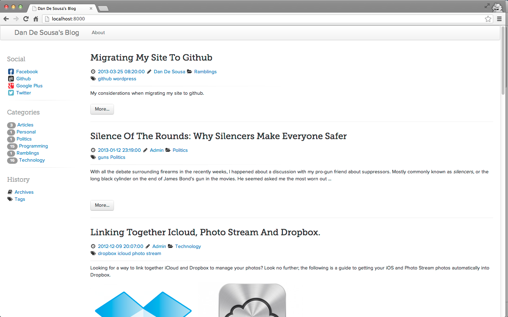

Timberland
==================

Timberland is a custom made, bootstrap base theme. I am my no means a web designer, but I wanted a theme to help me get familiar with bootstrap and blog on a site with clean, minimalist lines.

The theme supports the following:

  * Articles and pages as a standard pelican theme
  * Disque comment integration
  * Twitter integration
  * Facebook integration (not fully tested)
  * Font-Awesome integration for customized icons for blog components and social networking icons
  * Integration of proxima-nova and museo-slab fonts (also used by Font-Awesome site), and more sane typography spacing for articles.

If you use the theme and would like to contribute or suggest improvements feel free. Also feel free to fork or copy it and create a new theme, its Apache licensed.

I will likely be frequently updating this in the near future, so any feedback or issue reporting is appreciated.

Social Icons
-------------

Currently only the social networking services shown in the screenshot are "colorized". If you need any others, please update timberland-icons.css and send a pull request.

Pelican Shovel
--------------

Like this theme? Also consider taking a look at my other pelican project, [pelican-shovel][dandesousa/pelican-shovel]. It helps you manage your pelican blog!

[dandesousa/pelican-shovel]: http://github.com/dandesousa/pelican-shovel
[screenshot]: https://github.com/dandesousa/pelican-timberland/blob/master/screenshot.png
